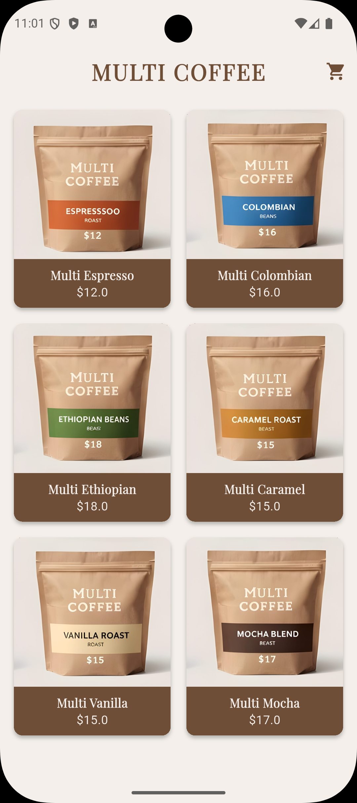
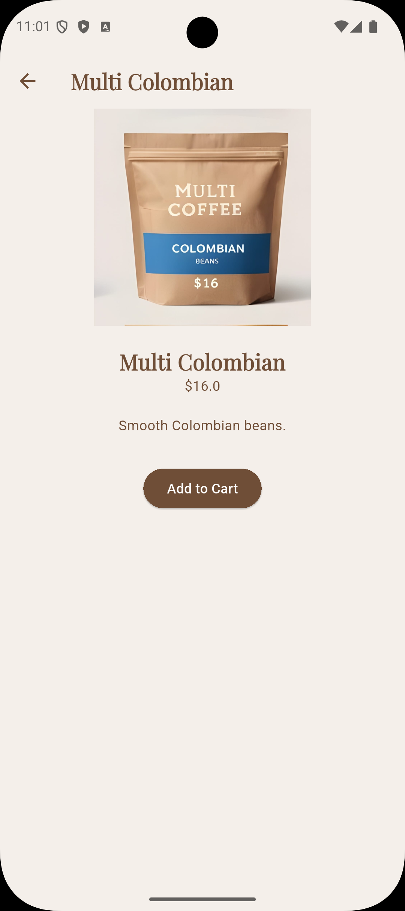
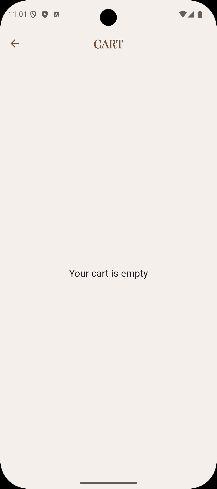
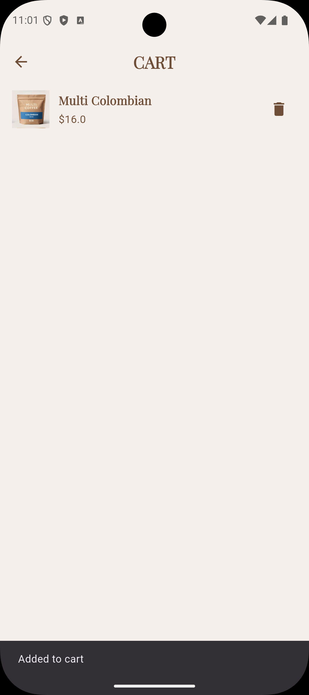

# Multi Coffee – Flutter Mini Catalog App ☕

### Project Description

Multi Coffee is a simple Flutter mini catalog application developed as part of a Flutter training program.
The application displays coffee products in a catalog layout where users can view product details and simulate adding items to a cart.

The project demonstrates basic Flutter concepts such as widget structure, UI layout, page navigation and simple state updates.

### Features

* Product catalog using **GridView**
* Product detail page
* Simple cart simulation
* Page navigation using **Navigator.push**
* Product model structure
* Asset image usage
* Minimal coffee themed UI

### Technologies

* Flutter SDK
* Dart
* Material Design Widgets

### Development Environment

Flutter Version: **3.32.0**
Emulator: **Pixel 9 Android Emulator**

### Screenshots

#### Home Page

#### Product Detail

#### Cart Page (Empty)

#### Cart Page

---

### Proje Açıklaması

Multi Coffee, Flutter eğitim programı kapsamında geliştirilen basit bir **mini katalog mobil uygulamasıdır**.
Uygulamada kahve ürünleri katalog şeklinde listelenir. Kullanıcılar ürün detaylarını görüntüleyebilir ve ürünleri sepete ekleyebilir.

Bu proje Flutter'ın temel kavramlarını öğrenmek amacıyla hazırlanmıştır.

### Özellikler

* GridView ile ürün katalog ekranı
* Ürün detay sayfası
* Basit sepet simülasyonu
* Navigator ile sayfalar arası geçiş
* Ürün modeli kullanımı
* Asset görsel kullanımı
* Minimal kahve temalı arayüz

### Kullanılan Teknolojiler

* Flutter SDK
* Dart
* Material Design Widgetları

### Geliştirme Ortamı

Flutter Version: **3.32.0**
Emulator: **Pixel 9 Android Emulator**

---

GitHub Repository
https://github.com/emrealidemirel/multi_coffee_catalog
